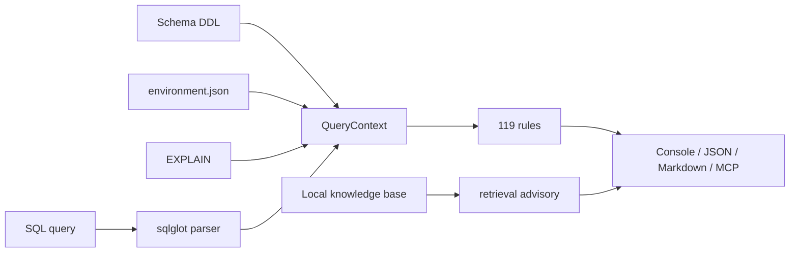

# ClickAdvisor


[](README.md)
[](README.en.md)

> Local-first CLI and MCP server for ClickHouse SQL analysis.
> It detects anti-patterns, suggests safe rewrites, and explains why a
> recommendation applies to ClickHouse.

ClickAdvisor helps DBAs, data engineers, and backend developers investigate slow
or risky ClickHouse queries faster. It accepts SQL, optionally uses schema DDL,
EXPLAIN, and environment context, applies deterministic rules, and returns a
console, JSON, or Markdown report.

[Project website](https://clickadvisor.lovable.app)

## Why ClickAdvisor If ChatGPT Already Exists?

ChatGPT, Claude, and other assistants are excellent for thinking, coding, and
exploring hypotheses. ClickAdvisor solves a different layer of the problem:
repeatable ClickHouse SQL checks where determinism, versioned rules, audit
trails, and data control matter.

- Every finding has a `rule_id`, tier, ClickHouse version, and applicability conditions.
- Version-aware filtering hides rules that do not match the selected ClickHouse version.
- The tier model separates provable rewrites from approximate and advisory recommendations.
- `--mode explain` explains ClickHouse behavior in practical language.
- Local retrieval can add documentation links, but it does not replace the rule engine.

This is especially important for enterprise environments. In banks, telecom,
government, and other regulated sectors, SQL, DDL, EXPLAIN output, and
environment details often fall under compliance requirements.

By default, ClickAdvisor runs locally. When used through CLI, Docker, or CI
inside your own environment, user SQL is not sent to external servers and is not
sent to a generative LLM unless you explicitly do so. The MCP server is also
local, but if you connect it to an external AI client, data sharing depends on
what you send to that client and on your organization's security policies.

## Capabilities

- Analyze ClickHouse SQL without connecting to a database.
- Use ClickHouse version through `--ch-version` or HTTP `SELECT version()`.
- Read optional inputs: `--schema`, `--explain`, `--environment`.
- Produce `console`, `json`, and `markdown` reports.
- Expose ClickAdvisor to AI agents as a local MCP server.
- Add local links to ClickHouse docs / Altinity KB through embedded Qdrant.
- Compare rewrite candidates with `EXPLAIN ESTIMATE` when `--connect` is explicitly provided.
- Build prototype workload reports from sanitized `system.query_log` CSV exports.

## Project Numbers

| Area | Value |
|---|---:|
| SQL/config/workload analysis patterns | 119 |
| Rewrite/advisory rules `R-*` | 74 |
| Anti-pattern detectors `D-*` | 25 |
| Environment rules `E-*` | 20 |
| Total benchmark YAML cases | 327 |
| `synthetic_expanded` benchmark cases | 222 |
| Unit / validation / benchmark tests excluding integration | 325 |

## Architecture



More details: [docs/ARCHITECTURE.md](docs/ARCHITECTURE.md).

## Quick Start

### From Source

```bash
git clone https://github.com/olyannaa/clickadvisor.git
cd clickadvisor
poetry install
poetry run chadvisor analyze --sql query.sql
```

### Docker

```bash
docker build -t clickadvisor .
docker run --rm -v "$(pwd)":/queries clickadvisor analyze --sql /queries/query.sql
```

## Real Example

`query.sql`:

```sql
SELECT
    e.country,
    COUNT(DISTINCT e.user_id) AS unique_users,
    sumIf(e.revenue, e.status = 'paid') AS paid_revenue
FROM
(
    SELECT *
    FROM events FINAL
    WHERE message LIKE '%timeout%'
      AND (country = 'RU' OR country = 'KZ' OR country = 'BY')
) AS e
JOIN users AS u
    ON toUInt64(e.user_id) = u.id
GROUP BY e.country
HAVING e.country = 'RU'
ORDER BY paid_revenue DESC;
```

Run:

```bash
poetry run chadvisor analyze \
  --sql query.sql \
  --ch-version 25.3 \
  --output-format markdown \
  --no-retrieval
```

On this query, ClickAdvisor reports 10 findings, including:

- `R-001`: replace `COUNT(DISTINCT user_id)` with `uniqExact(user_id)`;
- `R-002`: consider `uniq(user_id)` when approximate distinct is acceptable;
- `D-005` and `R-102`: `LIKE '%...'` may need a skip index or another search strategy;
- `D-007`: `FINAL` can be expensive on large MergeTree tables;
- `D-011`, `R-008`, `R-020`: check type conversion around the JOIN key;
- `R-011`: move a non-aggregate `HAVING` predicate to `WHERE`.
- `R-014`: `GROUP BY` over a string column can be expensive and needs type/cardinality review.

Actual CLI output excerpt:


## CLI Usage

### Basic Analysis

```bash
poetry run chadvisor analyze --sql query.sql
```

### ClickHouse Version

```bash
poetry run chadvisor analyze --sql query.sql --ch-version 25.3
```

The version is used to filter rules by `ch_version_introduced`.

### Version Detection Through HTTP API

```bash
poetry run chadvisor analyze --sql query.sql \
  --connect http://localhost:8123 \
  --ch-user default \
  --ch-password secret
```

ClickAdvisor only runs `SELECT version()` and normalizes responses such as
`25.3.2.39` -> `25.3`.

### Explain Mode

```bash
poetry run chadvisor analyze --sql query.sql --mode explain
```

Explain mode describes why the recommendation matters for ClickHouse: sparse
primary key indexes, granules, `WHERE` / `HAVING` order, `FINAL`, `UNION` vs
`UNION ALL`, and related concepts.

### Output Formats

```bash
poetry run chadvisor analyze --sql query.sql --output-format console
poetry run chadvisor analyze --sql query.sql --output-format json
poetry run chadvisor analyze --sql query.sql --output-format markdown
```

`console` is useful locally, `json` fits CI/CD, and `markdown` works well for PR
comments and MCP responses.

### EXPLAIN ESTIMATE

```bash
poetry run chadvisor analyze --sql query.sql \
  --connect http://localhost:8123 \
  --ch-user default \
  --ch-password secret \
  --explain-estimate
```

ClickAdvisor compares the original SQL and rewrite candidate through `EXPLAIN
ESTIMATE`. It does not execute the query, run `ANALYZE`, or read user table
data.

### Schema, EXPLAIN, And Environment

```bash
poetry run chadvisor analyze --sql query.sql \
  --schema schema.sql \
  --environment environment.json \
  --explain explain.json
```

`environment.json` carries settings, hardware, cluster/workload facts, and
system metrics for `E-*` rules and some Tier 2 advisory rules. If no
environment file is provided, environment rules do not fire.

Minimal example:

```json
{
  "settings": {
    "max_threads": 64,
    "max_memory_usage": 90000000000,
    "join_use_nulls": true
  },
  "hardware": {
    "cpu_cores": 16,
    "ram_bytes": 128000000000,
    "disk_type": "hdd"
  },
  "workload": {
    "interactive_queries": true,
    "large_join": true,
    "bulk_inserts": true,
    "insert_format": "JSONEachRow"
  },
  "cluster": {
    "shards": 4,
    "replicas": 2,
    "has_local_replica": true
  }
}
```

## Knowledge Base And Retrieval Advisory

The knowledge base is built in `/data/kb/` from ClickHouse docs, Altinity KB,
ClickHouse blog posts, and release notes. To enable local semantic search,
index Markdown chunks:

```bash
poetry run chadvisor index-kb
```

Reindex:

```bash
poetry run chadvisor index-kb --reindex
```

Embedding model selection:

```bash
poetry run chadvisor index-kb --embedding-model multilingual-e5-small
poetry run chadvisor index-kb --embedding-model minilm-l6
```

After indexing, `.qdrant_db` is created locally. If it exists, `analyze` adds a
section with relevant documentation snippets.

## MCP Server

ClickAdvisor can be exposed to AI agents as a local MCP server:

```bash
poetry run chadvisor mcp-server
```

Example `claude_desktop_config.json`:

```json
{
  "mcpServers": {
    "clickadvisor": {
      "command": "poetry",
      "args": ["run", "chadvisor", "mcp-server"],
      "cwd": "/path/to/clickadvisor"
    }
  }
}
```

Available MCP tools:

- `analyze_query` — Markdown SQL report;
- `analyze_query_json` — structured JSON report;
- `list_rules` — registered rules;
- `detect_ch_version` — ClickHouse version detection through HTTP API.

More details: [docs/MCP.md](docs/MCP.md).

## Workload Analyzer Prototype

To move from single-query review toward a DBA review queue, ClickAdvisor includes
a prototype for sanitized `system.query_log` CSV exports:

```bash
poetry run chadvisor workload \
  --query-log examples/query_log_sample.csv \
  --output-format markdown \
  --top-n 3
```

It groups similar queries by normalized fingerprint, computes executions,
total/avg/p95 latency, read rows/bytes, and memory, then runs the representative
query through the rule engine and ranks top opportunities.

More details: [docs/workload.md](docs/workload.md).

## Quality Metrics

Current reproducible metrics as of 2026-06-30:

| Evaluation surface | Data | Metric |
|---|---|---:|
| Rule detection | `222` synthetic/schema/env benchmark cases | precision `1.000`, recall `1.000`, F1 `1.000` |
| ML classifier | `synthetic_expanded_v1` train/test split | best test macro F1 `0.691`, best test micro F1 `0.988` |
| Retrieval | `20` explicit query -> relevant docs pairs | MRR@3 `0.517` with MiniLM-L6 |
| Risk-label DS pipeline | `20 235` SQL records, group split + holdout | RF holdout macro F1 `0.949`, measured-only macro F1 `0.595` |
| Workload prototype | sample sanitized `query_log` CSV | normalized groups + top-N risk report |

What was evaluated:

- Rule detection: strict check that the analyzer returns exactly the expected `rule_id` set.
- Classifier ablation: multi-label classification over AST/SQL features.
- Retrieval ablation: `MRR@3` over explicit gold query -> relevant URL/keyword mappings.

Run the expanded synthetic benchmark:

```bash
poetry run python scripts/eval/run_benchmark.py \
  --cases-dir benchmark/cases/synthetic_expanded \
  --mode strict
```

Methodology: [docs/evaluation.md](docs/evaluation.md),
[docs/experiments/classifier_ablation.md](docs/experiments/classifier_ablation.md),
[docs/experiments/retrieval_ablation.md](docs/experiments/retrieval_ablation.md),
[docs/experiments/risk_labeling_ds_summary.md](docs/experiments/risk_labeling_ds_summary.md).

## Security And Data Handling

ClickAdvisor does not execute user SQL to measure speedup. When connected to
ClickHouse, it only uses:

- `SELECT version()` for version detection;
- `EXPLAIN ESTIMATE ...` when `--explain-estimate` is explicitly enabled.

For basic analysis, a SQL file is enough. Schema, EXPLAIN, environment context,
and ClickHouse connection are optional.

For enterprise adoption, the key point is that ClickAdvisor can run inside the
company perimeter, CI/CD, or an engineer's local environment without sending
SQL, DDL, EXPLAIN, or environment context to external LLM/API services. This
reduces risks around compliance, banking secrecy, personal data, trade secrets,
and internal naming conventions.

More details: [docs/security-local-first.md](docs/security-local-first.md).

## Development

```bash
poetry install
poetry run ruff check clickadvisor tests scripts
poetry run mypy clickadvisor
poetry run pytest --ignore=tests/integration
poetry run python scripts/eval/run_benchmark.py
```

The version detection integration test expects a ClickHouse HTTP endpoint at
`localhost:8123`. GitHub Actions starts it as a service container.

## AI-Assisted Development

Codex and Claude were used systematically during development for architecture
review, test variants, documentation, and consistency checks. They are not part
of ClickAdvisor's trusted runtime path: CLI/MCP recommendations are produced by
the rule engine, ML evaluation surface, and local retrieval.

## Not Claimed As Ready

- Product generative LLM in the trusted runtime path.
- Live `query_log` analysis through `--connect --since`; a CSV prototype exists.
- Automatic DDL changes.
- Running `ANALYZE` or replaying queries on user data.
- Automatically applying Tier 2 design/storage recommendations without DBA review.

---

[](README.md)
[](README.en.md)
