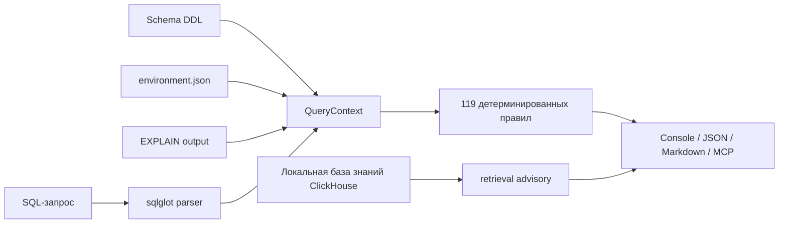

# ClickAdvisor


> CLI-утилита и MCP-сервер для анализа ClickHouse SQL-запросов.
> Находит антипаттерны, предлагает rewrite-рекомендации и объясняет,
> почему рекомендация безопасна именно для ClickHouse.

[Русский](README.md) | [English](README.en.md)

ClickAdvisor помогает DBA и разработчикам быстрее разбирать медленные запросы:
он принимает SQL-файл, парсит запрос через `sqlglot`, применяет набор
детерминированных правил и возвращает отчёт в консоли, JSON или Markdown.

Главный принцип проекта: **rules + ML + retrieval**, где доверенное ядро
анализа остаётся rule engine с явно описанными условиями применимости. ML
используется как отдельная evaluation surface, retrieval добавляет локальные
ссылки на документацию, а утилита не отправляет SQL во внешние сервисы.

[Сайт проекта](https://clickadvisor.lovable.app)

## Зачем ClickAdvisor, если уже есть ChatGPT?

ChatGPT, Claude и другие ассистенты отлично помогают думать, писать код и
быстро получать гипотезы. ClickAdvisor не конкурирует с ними, а закрывает другой
слой задачи: воспроизводимую проверку ClickHouse SQL там, где важны
детерминированность, audit trail и отсутствие передачи SQL наружу.

- каждое срабатывание имеет `rule_id`, `tier`, версию ClickHouse и описание условий;
- version-aware фильтр скрывает правила, которые не подходят для указанной версии;
- `Tier 1A/1B/1C` отделяет доказуемые rewrite от приближённых и условных советов;
- режим `--mode explain` объясняет принцип работы ClickHouse простым языком;
- retrieval advisory добавляет ссылки на локальную knowledge base, но не заменяет rule engine.

Для enterprise-среды это особенно важно: в банках, телекоме, госсекторе и других
регулируемых компаниях SQL, DDL и сведения об окружении часто попадают под
compliance-требования. ClickAdvisor работает локально: пользовательский SQL не
уходит на внешние серверы и не отправляется в generative LLM.

## Статус проекта

Проект находится в активной разработке. В репозитории уже реализованы:

- CLI-команда `chadvisor analyze`;
- MCP-сервер `chadvisor mcp-server`;
- 74 rewrite/advisory-правила `R-*`;
- 25 детекторов антипаттернов `D-*`;
- 20 environment-правил `E-*`;
- version detection через ClickHouse HTTP API;
- console / JSON / Markdown отчёты;
- режим объяснений `--mode explain`;
- optional retrieval advisory через embedded Qdrant KB;
- optional `EXPLAIN ESTIMATE` сравнение через ClickHouse HTTP API;
- synthetic benchmark для проверки срабатывания правил.

В каталоге `/docs/rules/cards/` описаны 119 валидируемых карточек правил:
119 имеют зарегистрированную реализацию и прямое тестовое покрытие, backlog
по карточкам закрыт.

## Что внутри



| Компонент | Сейчас в репозитории |
|---|---:|
| Карточки правил | 119 |
| Реализованные правила | 119 |
| Backlog-карточки | 0 |
| Unit / validation / benchmark tests без integration | 325 |
| Benchmark YAML cases всего | 327 |
| `synthetic_expanded` cases | 222 |

## Быстрый старт

### Запуск из исходников

```bash
git clone https://github.com/olyannaa/clickadvisor.git
cd clickadvisor
poetry install
poetry run chadvisor analyze --sql query.sql
```

### Через Docker

```bash
docker build -t clickadvisor .
docker run --rm -v "$(pwd)":/queries clickadvisor analyze --sql /queries/query.sql
```

## Пример `query.sql`

Пример ниже специально содержит несколько типичных проблем: точный
`COUNT(DISTINCT)`, `FINAL`, `SELECT *`, преобразование типа в `JOIN`,
неограниченный результат, `LIKE` с leading wildcard и `HAVING`, который можно
частично перенести ближе к чтению данных.

```sql
SELECT
    e.country,
    COUNT(DISTINCT e.user_id) AS unique_users,
    sumIf(e.revenue, e.status = 'paid') AS paid_revenue
FROM
(
    SELECT *
    FROM events FINAL
    WHERE message LIKE '%timeout%'
      AND (country = 'RU' OR country = 'KZ' OR country = 'BY')
) AS e
JOIN users AS u
    ON toUInt64(e.user_id) = u.id
GROUP BY e.country
HAVING e.country = 'RU'
ORDER BY paid_revenue DESC;
```

Что ClickAdvisor найдёт в таком запросе:

- `R-001`: `COUNT(DISTINCT user_id)` можно заменить на `uniqExact(user_id)`;
- `R-002`: если допустима приблизительная оценка, можно рассмотреть `uniq(user_id)`;
- `R-010`: цепочку `country = ... OR country = ...` можно переписать в `country IN (...)`.
- `D-003`: `SELECT *` читает все колонки в column-store;
- `D-004`: запрос может вернуть неограниченный результат без `LIMIT`;
- `D-005` и `R-102`: `LIKE '%...'` требует осторожности и может нуждаться в skip-index;
- `D-007`: `FINAL` может быть дорогим на больших MergeTree-таблицах;
- `D-011`, `R-008`, `R-020`: приведение типа вокруг JOIN-ключа стоит проверить;
- `R-011`: часть условий из `HAVING` может быть перенесена в `WHERE`.

Запуск:

```bash
poetry run chadvisor analyze --sql query.sql --ch-version 25.3
```

## Использование CLI

### Базовый анализ

```bash
poetry run chadvisor analyze --sql query.sql
```

Если версия ClickHouse не указана, применяются все зарегистрированные правила.
Для более точных рекомендаций лучше передавать версию явно.

### Анализ с версией ClickHouse

```bash
poetry run chadvisor analyze --sql query.sql --ch-version 25.3
```

Версия используется для фильтрации правил по `ch_version_introduced`.

### Автоопределение версии через HTTP API

```bash
poetry run chadvisor analyze --sql query.sql \
  --connect http://localhost:8123 \
  --ch-user default \
  --ch-password secret
```

ClickAdvisor выполнит только `SELECT version()` и нормализует ответ, например
`25.3.2.39` → `25.3`.

### Режим объяснений

```bash
poetry run chadvisor analyze --sql query.sql --mode explain
```

В этом режиме отчёт объясняет не только «что заменить», но и принцип работы
ClickHouse: sparse primary key index, granules, порядок выполнения `WHERE` /
`HAVING`, стоимость `FINAL`, разницу между `UNION` и `UNION ALL` и так далее.

### Форматы вывода

```bash
poetry run chadvisor analyze --sql query.sql --output-format console
poetry run chadvisor analyze --sql query.sql --output-format json
poetry run chadvisor analyze --sql query.sql --output-format markdown
```

`console` удобен для локальной диагностики, `json` — для CI/CD, `markdown` —
для PR-комментариев и MCP-ответов.

### EXPLAIN ESTIMATE

```bash
poetry run chadvisor analyze --sql query.sql \
  --connect http://localhost:8123 \
  --ch-user default \
  --ch-password secret \
  --explain-estimate
```

В этом режиме ClickAdvisor сравнивает исходный SQL и rewrite-кандидат через
`EXPLAIN ESTIMATE`. Запрос не выполняется, `ANALYZE` не запускается,
пользовательские данные не читаются. Используется только оценка планировщика
ClickHouse (`rows`, `marks`).

### Схема, EXPLAIN и окружение как дополнительные входы

CLI уже принимает опциональные файлы:

```bash
poetry run chadvisor analyze --sql query.sql \
  --schema schema.sql \
  --environment environment.json \
  --explain explain.json
```

`environment.json` передаёт настройки, hardware, факты о кластере/workload и
system metrics для `E-*` и части Tier 2 advisory rules. Если файл окружения не
передан, environment-правила не срабатывают и SQL-only анализ остаётся прежним.

Минимальный пример:

```json
{
  "settings": {
    "max_threads": 64,
    "max_memory_usage": 90000000000,
    "join_use_nulls": true
  },
  "hardware": {
    "cpu_cores": 16,
    "ram_bytes": 128000000000,
    "disk_type": "hdd"
  },
  "workload": {
    "interactive_queries": true,
    "large_join": true,
    "bulk_inserts": true,
    "insert_format": "JSONEachRow"
  },
  "cluster": {
    "shards": 4,
    "replicas": 2,
    "has_local_replica": true
  }
}
```

## База знаний и retrieval advisory

База знаний собирается в `/data/kb/` из документации ClickHouse, Altinity KB,
ClickHouse blog и release notes. Для локального semantic search нужно
проиндексировать Markdown-чанки:

```bash
poetry run chadvisor index-kb
```

Повторная индексация:

```bash
poetry run chadvisor index-kb --reindex
```

Выбор embedding-модели:

```bash
poetry run chadvisor index-kb --embedding-model multilingual-e5-small
poetry run chadvisor index-kb --embedding-model minilm-l6
```

После индексации появится локальная директория `.qdrant_db`. Если она есть,
`analyze` по умолчанию добавляет отдельную секцию с релевантными фрагментами
документации.

Явное управление retrieval:

```bash
poetry run chadvisor analyze --sql query.sql --retrieval
poetry run chadvisor analyze --sql query.sql --no-retrieval
```

Retrieval работает локально через embeddings и Qdrant. Generative LLM не входит
в critical path MVP: Claude/Cursor могут вызывать ClickAdvisor через MCP, но
сами рекомендации формируются rule engine и retrieval-компонентами.

## MCP-сервер

ClickAdvisor можно подключить к AI-агентам как MCP-сервер:

```bash
poetry run chadvisor mcp-server
```

Пример для `claude_desktop_config.json`:

```json
{
  "mcpServers": {
    "clickadvisor": {
      "command": "poetry",
      "args": ["run", "chadvisor", "mcp-server"],
      "cwd": "/path/to/clickadvisor"
    }
  }
}
```

Доступные MCP tools:

- `analyze_query` — Markdown-отчёт по SQL;
- `analyze_query_json` — структурированный JSON;
- `list_rules` — список зарегистрированных правил;
- `detect_ch_version` — определение версии ClickHouse через HTTP API.

Подробности: [`docs/MCP.md`](docs/MCP.md).

## Правила и покрытие

Текущий каталог:

| Поверхность | Карточки | Реализовано и протестировано | Backlog |
|---|---:|---:|---:|
| `R-*` rewrite/advisory rules | 74 | 74 | 0 |
| `D-*` detectors | 25 | 25 | 0 |
| `E-*` environment cards | 20 | 20 | 0 |
| Всего | 119 | 119 | 0 |

Реализованные диапазоны: `R-001`…`R-062`, `R-101`…`R-112`,
`D-001`…`D-025` и `E-001`…`E-020`.

Полный список карточек хранится в [`docs/rules/cards/`](docs/rules/cards/),
а фактическая регистрация правил — в
[`clickadvisor/rules/registry.py`](clickadvisor/rules/registry.py).

Классификация tier:

- `1A` — формально эквивалентные rewrite-правила;
- `1B` — приближённые или opt-in рекомендации;
- `1C` — условные рекомендации, зависящие от схемы или контекста;
- `detector` — диагностика антипаттерна без автоматического rewrite.
- `env` — environment-aware настройки по hardware, settings, cluster и workload.

## Метрики качества

Текущие воспроизводимые метрики на 2026-06-30:

- rule detection on expanded synthetic benchmark: `222/222` cases, strict
  precision `1.000`, recall `1.000`, F1 `1.000`;
- classifier on `synthetic_expanded_v1` test split: best test macro F1
  `0.691`, best test micro F1 `0.988`;
- retrieval MRR@3: `0.517` on `20` explicit query-doc pairs with MiniLM-L6
  (`0.458` for the current multilingual-e5 default).

Rule detection — это deterministic regression metric, а не заявление о
генерализации ML. Classifier F1 указан отдельно, потому что только этот слой
обучается на train split.

Что именно оценивалось:

- rule detection: строгая проверка, что analyzer на synthetic/schema/env cases
  возвращает ровно ожидаемые `rule_id`;
- classifier ablation: multi-label классификация по AST/SQL features на
  train/test split `synthetic_expanded_v1`;
- retrieval ablation: `MRR@3` по явной gold mapping query → релевантные
  URL/keywords документации, а не по любому найденному ClickHouse-фрагменту.

Запуск expanded synthetic benchmark:

```bash
poetry run python scripts/eval/run_benchmark.py \
  --cases-dir benchmark/cases/synthetic_expanded \
  --mode strict
```

Classifier ablation:

```bash
poetry run python scripts/eval/ablation_classifiers.py --run-id classifier_ablation_current
```

Для retrieval есть отдельный ablation-скрипт:

```bash
poetry run python scripts/eval/ablation_embeddings.py
```

Результаты выбора embedding-модели описаны в
[`docs/adr/ADR-013-embedding-model-selection.md`](docs/adr/ADR-013-embedding-model-selection.md).
Подробная методика и текущие результаты: [`docs/evaluation.md`](docs/evaluation.md),
[`docs/experiments/classifier_ablation.md`](docs/experiments/classifier_ablation.md),
[`docs/experiments/retrieval_ablation.md`](docs/experiments/retrieval_ablation.md).

## Архитектура

```text
SQL + optional Schema / EXPLAIN / Environment / CH version
        ↓
   SQL Parser (sqlglot, ClickHouse dialect)
        ↓
 ┌──────────────────────────────────────┐
 │  Rule Engine                         │
 │  ├─ Tier 1A: эквивалентные rewrite   │
 │  ├─ Tier 1B: opt-in / approximate    │
 │  ├─ Tier 1C: conditional rewrite     │
 │  └─ Detectors: антипаттерны          │
 └──────────────────────────────────────┘
        ↓
 Version Filter + optional EXPLAIN ESTIMATE
        ↓
 optional Retrieval Advisor (Qdrant + embeddings)
        ↓
 Report (console | JSON | Markdown | MCP)
```

Подробнее: [`docs/ARCHITECTURE.md`](docs/ARCHITECTURE.md).

## Безопасность и данные

ClickAdvisor не выполняет пользовательский SQL-запрос для измерения speedup.
При подключении к ClickHouse используются только:

- `SELECT version()` для определения версии;
- `EXPLAIN ESTIMATE ...` при явном флаге `--explain-estimate`.

Для базового анализа достаточно SQL-файла. Схема, EXPLAIN и подключение к
кластеру — опциональные источники контекста.

Для enterprise-внедрения ключевой принцип такой: ClickAdvisor можно запускать в
контуре компании, CI/CD или локальной среде инженера без отправки SQL,
DDL, EXPLAIN и environment-контекста во внешние LLM/API. Это снижает риски для
compliance, банковской тайны, персональных данных, коммерческой тайны и
внутренних naming conventions.

## Разработка

```bash
poetry install
poetry run ruff check clickadvisor tests scripts
poetry run mypy clickadvisor
poetry run pytest --ignore=tests/integration
poetry run python scripts/eval/run_benchmark.py
```

Integration test для version detection ожидает ClickHouse HTTP endpoint на
`localhost:8123`. В GitHub Actions он поднимается как service container.

### AI-assisted development

Codex и Claude использовались системно в разработке: для ревью архитектурных
решений, генерации вариантов тестов, документации и проверки согласованности
плана с кодом. Они не входят в trusted runtime path ClickAdvisor: рекомендации
CLI/MCP формируются rule engine, ML evaluation surface и локальным retrieval.

## Что не заявляется как готовое в CLI v1

- продуктовый generative LLM в critical path;
- автоматический анализ `query_log`;
- автоматические DDL-изменения;
- выполнение `ANALYZE` или реальный replay запросов на данных;
- автоматическое применение Tier 2 design/storage рекомендаций без проверки DBA.

README отражает именно то, что поддерживает текущий код репозитория.

---

[Русский](README.md) | [English](README.en.md)
