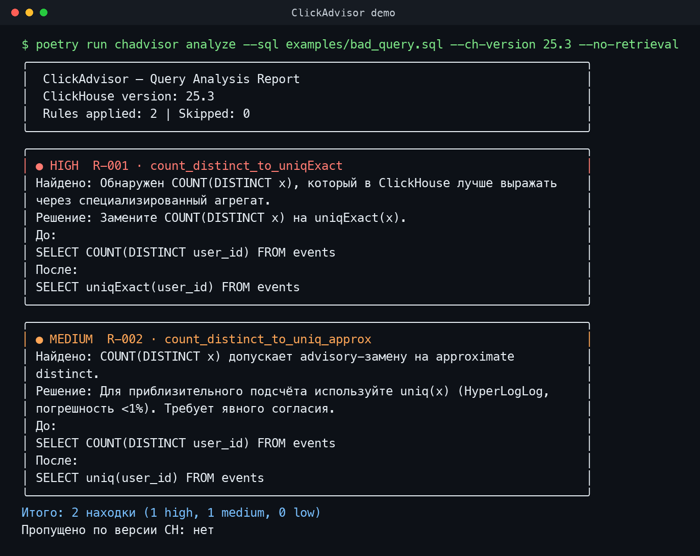

# ClickAdvisor


> Local-first CLI and MCP advisor for ClickHouse query optimization.
> Находит SQL-антипаттерны, показывает формально обоснованные rewrite-рекомендации, дополняет их retrieval-контекстом из KB и при необходимости оценивает влияние через `EXPLAIN ESTIMATE`.



- рекомендации привязаны к `rule_id`, tier и версии ClickHouse;
- Tier `1A/1B/1C` явно отделяет формальные rewrite-правила от условных и приближённых;
- retrieval advisory добавляет ссылки на документацию, но не заменяет rule engine;
- `EXPLAIN ESTIMATE` может показать оценку сокращения строк/marks без `ANALYZE` и без чтения пользовательских данных;
- MCP server позволяет вызывать тот же локальный анализ из Claude Desktop, Cursor, Continue и других агентов.

## Возможности v1.0

- 21+ правил и детекторов для ClickHouse SQL (`R-001`…`R-018`, `D-003`, `D-004`, `D-007`)
- version-aware filtering по `--ch-version` или автоопределению через `--connect`
- console / JSON / Markdown отчёты
- режим `--mode explain` с образовательными пояснениями
- retrieval-based advisory через embedded Qdrant KB
- выбор embedding-модели при индексации KB
- optional `EXPLAIN ESTIMATE` impact summaries
- stdio MCP server с tools и prompts
- synthetic benchmark и ablation experiment для embedding-моделей

## Быстрый старт

### Из исходников

```bash
git clone https://github.com/olyannaa/clickadvisor.git
cd clickadvisor
poetry install
poetry run chadvisor analyze --sql examples/bad_query.sql
```

### pip

```bash
pip install clickadvisor  # когда пакет будет опубликован
chadvisor analyze --sql examples/bad_query.sql
```

### Docker

```bash
docker run --rm -v $(pwd):/queries \
  ghcr.io/username/clickadvisor:latest \
  analyze --sql /queries/query.sql
```

## CLI usage

### Базовый анализ

```bash
poetry run chadvisor analyze --sql query.sql
```

### С указанием версии ClickHouse

```bash
poetry run chadvisor analyze --sql query.sql --ch-version 25.3
```

### Автоопределение версии через HTTP API

```bash
poetry run chadvisor analyze --sql query.sql \
  --connect http://host:8123 \
  --ch-user default \
  --ch-password secret
```

### Режим объяснений

```bash
poetry run chadvisor analyze --sql query.sql --mode explain
```

### Форматы вывода

```bash
poetry run chadvisor analyze --sql query.sql --output-format json
poetry run chadvisor analyze --sql query.sql --output-format markdown
```

### EXPLAIN ESTIMATE impact

Если указан `--connect`, ClickAdvisor может выполнить `EXPLAIN ESTIMATE` для исходного SQL и rule rewrite (`example_after`) и добавить строку `📊 Влияние`:

```bash
poetry run chadvisor analyze --sql query.sql \
  --connect http://localhost:8123 \
  --explain-estimate
```

Это не запускает `ANALYZE` и не читает пользовательские данные; используется оценка планировщика ClickHouse (`rows`, `marks`).

## Retrieval advisory KB

Индексация KB создаёт embedded Qdrant базу `.qdrant_db` из `data/kb/chunks/`:

```bash
poetry run chadvisor index-kb
```

Повторная индексация:

```bash
poetry run chadvisor index-kb --reindex
```

Выбор embedding-модели:

```bash
poetry run chadvisor index-kb --embedding-model multilingual-e5-small
poetry run chadvisor index-kb --embedding-model minilm-l6
```

Доступные модели:

| Key | Model | Size | Notes |
|---|---|---:|---|
| `multilingual-e5-small` | `intfloat/multilingual-e5-small` | 117 MB | default, multilingual, E5 prefixes |
| `minilm-l6` | `sentence-transformers/all-MiniLM-L6-v2` | 80 MB | english-only, faster, best MRR@3 on current English KB |

При наличии `.qdrant_db` команда `analyze` по умолчанию добавляет RAG-находки отдельной секцией `📚 Релевантная документация`. Управление:

```bash
poetry run chadvisor analyze --sql query.sql --retrieval
poetry run chadvisor analyze --sql query.sql --no-retrieval
```

## MCP Server

ClickAdvisor предоставляет stdio MCP server:

```bash
poetry run chadvisor mcp-server
```

Подробная инструкция для Claude Desktop, Cursor, Continue и других клиентов: [`docs/MCP.md`](docs/MCP.md).

MCP tools:

- `analyze_query` — Markdown-отчёт для SQL
- `analyze_query_json` — структурированный JSON без RAG-находок
- `list_rules` — список правил
- `detect_ch_version` — определение версии ClickHouse через HTTP API

MCP prompts:

- `analyze`
- `explain`

## Правила и покрытие

| Rule ID | Описание | Tier |
|---|---|---|
| `R-001` | `COUNT(DISTINCT x)` → `uniqExact(x)` | `1A` |
| `R-002` | `COUNT(DISTINCT x)` → advisory `uniq(x)` | `1B` |
| `R-003` | `quantileExact(...)` → advisory `quantileTDigest(...)` | `1B` |
| `R-004` | `COUNT(*) FROM (SELECT DISTINCT ...)` collapse | `1A` |
| `R-005` | `toDate(col) = ...` → datetime range | `1A` |
| `R-006` | `toYYYYMM(...)` / `toStartOfMonth(...)` → range | `1A` |
| `R-007` | `toStartOfHour/Day/FifteenMinutes(...)` → range | `1A` |
| `R-008` | redundant `CAST(...)` in filter | `1C` |
| `R-009` | singleton `IN (...)` → equality | `1A` |
| `R-010` | `col = a OR col = b OR col = c` → `IN (...)` | `1A` |
| `R-011` | non-aggregate predicate in `HAVING` → `WHERE` | `1C` |
| `R-012` | constant predicate elimination | `1A` |
| `R-013` | `length(x) = 0 / > 0 / != 0` → `empty/notEmpty` | `1A` |
| `R-014` | advisory hash-based `GROUP BY` for long strings | `1B` |
| `R-015` | `DISTINCT` after equivalent `GROUP BY` removal | `1A` |
| `R-016` | `ORDER BY` in subquery without `LIMIT` | `1C` |
| `R-017` | subquery filter pushdown | `1A` |
| `R-018` | advisory `UNION` → `UNION ALL` | `1C` |
| `D-003` | top-level `SELECT *` detector | `detector` |
| `D-004` | missing `LIMIT` on non-aggregate top-level select | `detector` |
| `D-007` | costly `FINAL` modifier detector | `detector` |

## Метрики качества

Synthetic benchmark:

```bash
poetry run python scripts/eval/run_benchmark.py
```

Current curated synthetic benchmark (`lenient` mode): precision/recall/F1 are expected to remain `1.00` for rule detection.

Embedding ablation:

```bash
poetry run python scripts/eval/ablation_embeddings.py
```

Latest 2000-chunk ablation reports MRR@3 over synthetic cases and prints a recommendation. On the English-heavy KB, `all-MiniLM-L6-v2` had the best MRR@3, but the default remains multilingual E5; see [`docs/adr/ADR-013-embedding-model-selection.md`](docs/adr/ADR-013-embedding-model-selection.md).

## Архитектура

```text
SQL + Schema + optional EXPLAIN / CH version
        ↓
   SQL Parser (sqlglot)
        ↓
 ┌──────────────────┐
 │  Rule Engine     │
 │  ├─ Tier 1A: formally equivalent rewrites
 │  ├─ Tier 1B: approximate / opt-in guidance
 │  ├─ Tier 1C: conditional rewrites
 │  └─ Detectors: antipattern detection
 └──────────────────┘
        ↓
 Version Filter + optional EXPLAIN ESTIMATE comparator
        ↓
 optional Retrieval Advisor (Qdrant + embeddings)
        ↓
 Report (console | JSON | Markdown | MCP)
```

## Разработка

```bash
poetry install
poetry run pytest -k 'not test_detect_version'
poetry run ruff check clickadvisor tests scripts
poetry run python scripts/eval/run_benchmark.py
```

`tests/integration/test_version.py::test_detect_version` ожидает доступный ClickHouse HTTP endpoint на `localhost:8123` с подходящими credentials.
