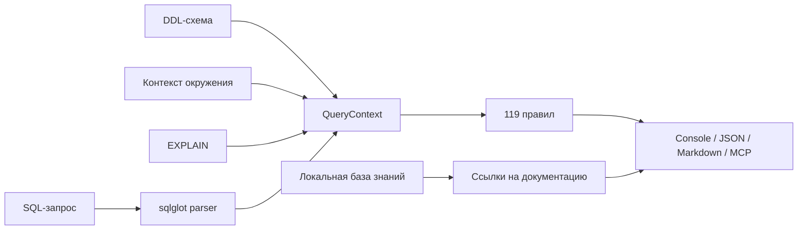
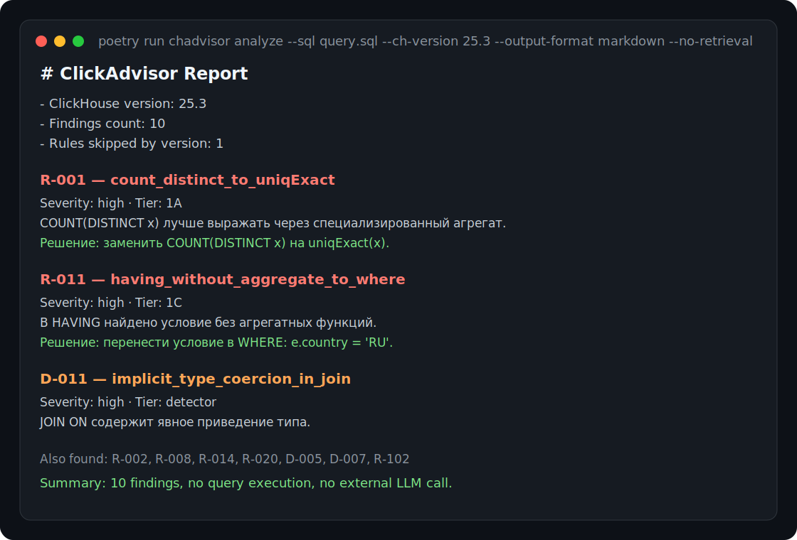

# ClickAdvisor


[](README.md)
[](README.en.md)

> Локальный CLI и MCP-сервер для анализа ClickHouse SQL.
> Находит антипаттерны, предлагает безопасные варианты переписывания и объясняет,
> почему совет применим именно для ClickHouse.

ClickAdvisor помогает DBA, дата-инженерам и backend-разработчикам быстрее
разбирать медленные или рискованные ClickHouse-запросы. Он принимает SQL,
опционально учитывает DDL-схему, EXPLAIN и контекст окружения, применяет
детерминированные правила и возвращает отчет в консоли, JSON или Markdown.

[Сайт проекта](https://clickadvisor.lovable.app)

## Зачем ClickAdvisor, если уже есть ChatGPT?

ChatGPT, Claude и другие ассистенты отлично помогают думать, писать код и
быстро получать гипотезы. ClickAdvisor закрывает другой слой задачи:
воспроизводимую проверку ClickHouse SQL там, где важны предсказуемость,
версионированные правила, след аудита и контроль над данными.

- У каждого срабатывания есть `rule_id`, уровень доверия, версия ClickHouse и условия применимости.
- Фильтр по версии скрывает правила, которые не подходят для указанной версии ClickHouse.
- Модель уровней отделяет доказуемые переписывания от приближенных и рекомендательных советов.
- Режим `--mode explain` объясняет принцип работы ClickHouse простым языком.
- Локальный поиск по базе знаний добавляет ссылки на документацию, но не заменяет движок правил.

Для enterprise-среды это особенно важно: в банках, телекоме, госсекторе и
других регулируемых компаниях SQL, DDL, EXPLAIN и сведения об окружении часто
попадают под compliance-требования.

По умолчанию ClickAdvisor работает локально. Если вы используете CLI, Docker или
CI-запуск внутри своего контура, пользовательский SQL не уходит на внешние
серверы и не отправляется в генеративную языковую модель без вашего явного
действия. MCP-сервер тоже запускается локально, но если вы подключаете его к
внешнему AI-клиенту, то передача SQL уже зависит от того, что именно вы
отправляете этому клиенту и какие политики безопасности действуют в вашей
организации.

## Что умеет

- Анализировать ClickHouse SQL без подключения к базе.
- Учитывать версию ClickHouse через `--ch-version` или HTTP `SELECT version()`.
- Читать дополнительные входы: `--schema`, `--explain`, `--environment`.
- Возвращать отчеты в `console`, `json` и `markdown`.
- Подключаться к AI-агентам как локальный MCP-сервер.
- Добавлять локальные ссылки на документацию ClickHouse и Altinity KB через встроенный Qdrant.
- Сравнивать варианты переписывания через `EXPLAIN ESTIMATE`, если явно передан `--connect`.
- Строить prototype workload-отчеты по sanitized CSV export из `system.query_log`.

## Цифры проекта

| Что измеряется | Значение |
|---|---:|
| Паттерны анализа SQL/config/workload | 119 |
| Правила переписывания и рекомендаций `R-*` | 74 |
| Детекторы антипаттернов `D-*` | 25 |
| Правила окружения `E-*` | 20 |
| Benchmark YAML-кейсы всего | 327 |
| Кейсы `synthetic_expanded` | 222 |
| Unit-, validation- и benchmark-тесты без integration | 325 |

## Архитектура



Подробнее: [docs/ARCHITECTURE.md](docs/ARCHITECTURE.md).

## Быстрый старт

### Запуск из исходников

```bash
git clone https://github.com/olyannaa/clickadvisor.git
cd clickadvisor
poetry install
poetry run chadvisor analyze --sql query.sql
```

### Через Docker

```bash
docker build -t clickadvisor .
docker run --rm -v "$(pwd)":/queries clickadvisor analyze --sql /queries/query.sql
```

## Реальный пример

`query.sql`:

```sql
SELECT
    e.country,
    COUNT(DISTINCT e.user_id) AS unique_users,
    sumIf(e.revenue, e.status = 'paid') AS paid_revenue
FROM
(
    SELECT *
    FROM events FINAL
    WHERE message LIKE '%timeout%'
      AND (country = 'RU' OR country = 'KZ' OR country = 'BY')
) AS e
JOIN users AS u
    ON toUInt64(e.user_id) = u.id
GROUP BY e.country
HAVING e.country = 'RU'
ORDER BY paid_revenue DESC;
```

Запуск:

```bash
poetry run chadvisor analyze \
  --sql query.sql \
  --ch-version 25.3 \
  --output-format markdown \
  --no-retrieval
```

На этом запросе ClickAdvisor находит 10 срабатываний, включая:

- `R-001`: `COUNT(DISTINCT user_id)` можно заменить на `uniqExact(user_id)`;
- `R-002`: если допустима приблизительная оценка, можно рассмотреть `uniq(user_id)`;
- `D-005` и `R-102`: `LIKE '%...'` требует осторожности и может нуждаться в skip-index;
- `D-007`: `FINAL` может быть дорогим на больших MergeTree-таблицах;
- `D-011`, `R-008`, `R-020`: приведение типа вокруг JOIN-ключа стоит проверить;
- `R-011`: часть условий из `HAVING` можно перенести в `WHERE`.
- `R-014`: `GROUP BY` по строковой колонке может быть дорогим и требует проверки типа/кардинальности.

Реальный фрагмент вывода CLI:



## Использование CLI

### Базовый анализ

```bash
poetry run chadvisor analyze --sql query.sql
```

### Анализ с версией ClickHouse

```bash
poetry run chadvisor analyze --sql query.sql --ch-version 25.3
```

Версия используется для фильтрации правил по `ch_version_introduced`.

### Автоопределение версии через HTTP API

```bash
poetry run chadvisor analyze --sql query.sql \
  --connect http://localhost:8123 \
  --ch-user default \
  --ch-password secret
```

ClickAdvisor выполнит только `SELECT version()` и нормализует ответ, например
`25.3.2.39` -> `25.3`.

### Режим объяснений

```bash
poetry run chadvisor analyze --sql query.sql --mode explain
```

В этом режиме отчет объясняет не только что заменить, но и почему это важно для
ClickHouse: sparse primary key index, granules, порядок выполнения `WHERE` /
`HAVING`, стоимость `FINAL`, разницу между `UNION` и `UNION ALL` и так далее.

### Форматы вывода

```bash
poetry run chadvisor analyze --sql query.sql --output-format console
poetry run chadvisor analyze --sql query.sql --output-format json
poetry run chadvisor analyze --sql query.sql --output-format markdown
```

`console` удобен для локальной диагностики, `json` — для CI/CD, `markdown` —
для PR-комментариев и MCP-ответов.

### EXPLAIN ESTIMATE

```bash
poetry run chadvisor analyze --sql query.sql \
  --connect http://localhost:8123 \
  --ch-user default \
  --ch-password secret \
  --explain-estimate
```

ClickAdvisor сравнивает исходный SQL и вариант переписывания через `EXPLAIN
ESTIMATE`. Запрос не выполняется, `ANALYZE` не запускается, пользовательские
данные не читаются. Используется только оценка планировщика ClickHouse.

### Схема, EXPLAIN и окружение

```bash
poetry run chadvisor analyze --sql query.sql \
  --schema schema.sql \
  --environment environment.json \
  --explain explain.json
```

`environment.json` передает настройки, характеристики железа, факты о
кластере/workload и системные метрики для `E-*` и части рекомендательных правил
Tier 2. Если файл окружения не передан, правила окружения не срабатывают.

Минимальный пример:

```json
{
  "settings": {
    "max_threads": 64,
    "max_memory_usage": 90000000000,
    "join_use_nulls": true
  },
  "hardware": {
    "cpu_cores": 16,
    "ram_bytes": 128000000000,
    "disk_type": "hdd"
  },
  "workload": {
    "interactive_queries": true,
    "large_join": true,
    "bulk_inserts": true,
    "insert_format": "JSONEachRow"
  },
  "cluster": {
    "shards": 4,
    "replicas": 2,
    "has_local_replica": true
  }
}
```

## База знаний и рекомендации из документации

База знаний собирается в `/data/kb/` из документации ClickHouse, Altinity KB,
ClickHouse blog и release notes. Для локального semantic search нужно
проиндексировать Markdown-чанки:

```bash
poetry run chadvisor index-kb
```

Повторная индексация:

```bash
poetry run chadvisor index-kb --reindex
```

Выбор embedding-модели:

```bash
poetry run chadvisor index-kb --embedding-model multilingual-e5-small
poetry run chadvisor index-kb --embedding-model minilm-l6
```

После индексации появится локальная директория `.qdrant_db`. Если она есть,
`analyze` по умолчанию добавляет отдельную секцию с релевантными фрагментами
документации.

## MCP-сервер

ClickAdvisor можно подключить к AI-агентам как локальный MCP-сервер:

```bash
poetry run chadvisor mcp-server
```

Пример для `claude_desktop_config.json`:

```json
{
  "mcpServers": {
    "clickadvisor": {
      "command": "poetry",
      "args": ["run", "chadvisor", "mcp-server"],
      "cwd": "/path/to/clickadvisor"
    }
  }
}
```

Доступные MCP tools:

- `analyze_query` — Markdown-отчет по SQL;
- `analyze_query_json` — структурированный JSON;
- `list_rules` — список зарегистрированных правил;
- `detect_ch_version` — определение версии ClickHouse через HTTP API.

Подробности: [docs/MCP.md](docs/MCP.md).

## Workload analyzer prototype

Для перехода от анализа одного SQL к DBA review queue есть прототип анализа
sanitized `system.query_log` CSV:

```bash
poetry run chadvisor workload \
  --query-log examples/query_log_sample.csv \
  --output-format markdown \
  --top-n 3
```

Он группирует похожие запросы по normalized fingerprint, считает executions,
total/avg/p95 latency, read rows/bytes и memory, затем прогоняет representative
query через rule engine и ранжирует top opportunities.

Подробности: [docs/workload.md](docs/workload.md).

## Метрики качества

Текущие воспроизводимые метрики на 2026-06-30:

| Поверхность оценки | Данные | Метрика |
|---|---|---:|
| Детерминированные правила | `222` SQL/schema/env benchmark-кейса | precision `1.000`, recall `1.000`, F1 `1.000` |
| ML-классификатор | train/test split `synthetic_expanded_v1` | лучший test macro F1 `0.691`, лучший test micro F1 `0.988` |
| Поиск по документации | `20` явных пар запрос -> релевантная документация | MRR@3 `0.517` на MiniLM-L6 |
| Risk-label DS контур | `20 235` SQL-записей, group split + holdout | RF holdout macro F1 `0.949`, measured-only macro F1 `0.595` |
| Workload prototype | sample sanitized `query_log` CSV | normalized groups + top-N risk report |

Что именно оценивалось:

- Детерминированные правила: строгая проверка, что analyzer возвращает ровно ожидаемые `rule_id`.
- Абляция классификатора: multi-label классификация по AST/SQL features.
- Абляция поиска по документации: `MRR@3` по явной разметке запрос -> релевантные URL/keywords документации.

Запуск расширенного synthetic benchmark:

```bash
poetry run python scripts/eval/run_benchmark.py \
  --cases-dir benchmark/cases/synthetic_expanded \
  --mode strict
```

Подробная методика: [docs/evaluation.md](docs/evaluation.md),
[docs/experiments/classifier_ablation.md](docs/experiments/classifier_ablation.md),
[docs/experiments/retrieval_ablation.md](docs/experiments/retrieval_ablation.md),
[docs/experiments/risk_labeling_ds_summary.md](docs/experiments/risk_labeling_ds_summary.md).

## Безопасность и данные

ClickAdvisor не выполняет пользовательский SQL-запрос для измерения speedup.
При подключении к ClickHouse используются только:

- `SELECT version()` для определения версии;
- `EXPLAIN ESTIMATE ...` при явном флаге `--explain-estimate`.

Для базового анализа достаточно SQL-файла. Схема, EXPLAIN и подключение к
кластеру — опциональные источники контекста.

Для enterprise-внедрения ключевой принцип такой: ClickAdvisor можно запускать в
контуре компании, CI/CD или локальной среде инженера без отправки SQL, DDL,
EXPLAIN и environment-контекста во внешние LLM или API-сервисы. Это снижает риски для
compliance, банковской тайны, персональных данных, коммерческой тайны и
внутренних naming conventions.

Подробности: [docs/security-local-first.md](docs/security-local-first.md).

## Разработка

```bash
poetry install
poetry run ruff check clickadvisor tests scripts
poetry run mypy clickadvisor
poetry run pytest --ignore=tests/integration
poetry run python scripts/eval/run_benchmark.py
```

Integration test для version detection ожидает ClickHouse HTTP endpoint на
`localhost:8123`. В GitHub Actions он поднимается как сервисный контейнер.

## AI-assisted разработка

Codex и Claude использовались системно в разработке: для ревью архитектурных
решений, генерации вариантов тестов, документации и проверки согласованности
плана с кодом. Они не входят в доверенный путь выполнения ClickAdvisor:
рекомендации CLI/MCP формируются движком правил, ML-слоем оценки и локальным
поиском по документации.

## Что не заявляется как готовое

- Продуктовая генеративная LLM в доверенном пути выполнения.
- Live-анализ `query_log` через `--connect --since`; сейчас есть CSV prototype.
- Автоматические DDL-изменения.
- Выполнение `ANALYZE` или реальный replay запросов на данных.
- Автоматическое применение Tier 2 design/storage рекомендаций без проверки DBA.

---

[](README.md)
[](README.en.md)
