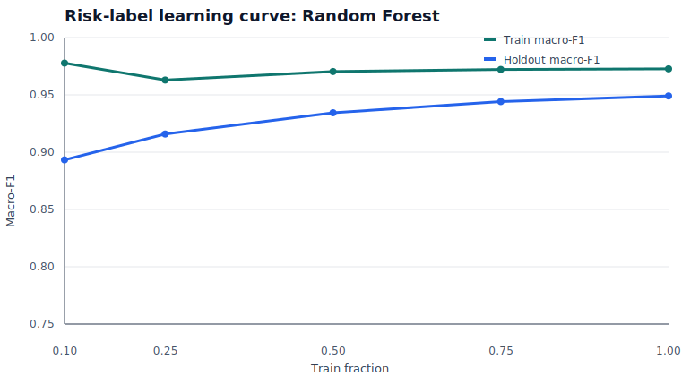

# Risk Learning Curve

Learning curve uses the risk-label train split and evaluates every fraction on the fixed holdout split. It is a stability diagnostic, not a separate model claim.

| Train fraction | Train records | Train macro-F1 | Holdout macro-F1 | Holdout MCC | Holdout high recall |
|---:|---:|---:|---:|---:|---:|
| 0.10 | 1415 | 0.978 | 0.893 | 0.894 | 0.675 |
| 0.25 | 3539 | 0.963 | 0.916 | 0.914 | 0.796 |
| 0.50 | 7078 | 0.970 | 0.934 | 0.930 | 0.850 |
| 0.75 | 10616 | 0.972 | 0.944 | 0.939 | 0.871 |
| 1.00 | 14155 | 0.973 | 0.949 | 0.945 | 0.887 |

## Interpretation

Holdout macro-F1 rises early and then stabilizes, while train macro-F1 remains higher. This is expected for a Random Forest over sparse SQL/text/rule features. The fixed holdout curve is the important signal: it does not collapse when the model sees the full train split, so the 20k risk-label result is more stable than the separate small synthetic classifier ablation.

